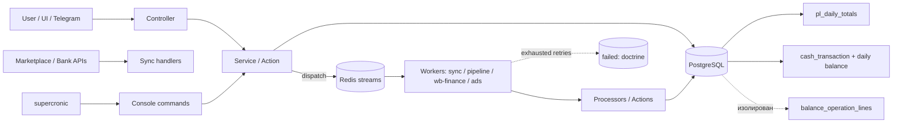

# 01. Current State Architecture

Базовый срез 2026-10-04. Пути относительно `site/`, если не указано иное.

## 1. Общая схема



Пунктир у Balance — в него не пишет ни один модуль.

## 2. Модули финансового контура

| Модуль | Роль | Ключевые таблицы | Связи |
|---|---|---|---|
| `Marketplace` (482 php) | WB/Ozon: сырьё → продажи/возвраты/затраты → закрытие месяца → P&L-документ | `marketplace_raw_documents`, `marketplace_sales`, `marketplace_returns`, `marketplace_costs`, `marketplace_month_closes`, `marketplace_financial_report_sync_statuses`, `marketplace_ozon_realizations` | пишет в Finance через `FinanceFacade` |
| `Ingestion` (296) | Новейший модуль: сырьё `ingest_raw_records` → `FinancialTransaction` (естественный ключ), заказы | `ingest_raw_records`, `ingest_sync_jobs`, `ingest_cursors`, `ingest_orders`, `ingest_order_status_events` | в P&L не пишет (гейт `ModuleBoundaryRules`) |
| `Cash` (200) | ДДС: движения, переводы, остатки, автоправила, импорт | `cash_transaction`, `cash_transaction_split`, `cash_transfer`, `money_account`, `money_account_daily_balance`, `cashflow_categories`, `payment_plan*` | в Finance — по кнопке пользователя |
| `Finance` (97) | ОПиУ: документы → регистр | `documents`, `document_operations`, `pl_categories`, `pl_daily_totals`, `pl_monthly_snapshots` | читается отчётами/аналитикой |
| `Balance` (71) | Журнал баланса, double-entry-like | `balance_books`, `balance_operations`, `balance_operation_lines`, `balance_account_states`, `balance_periods`, `balance_audit_events` | **нет входящих интеграций** |
| `Deals` (42) | Заказы/сделки (учёт, не проводки) | `deals`, `deal_items`, `deal_charges`, `deal_adjustments` | ни с кем не связан |
| `Loan` (26) | График кредита | `finance_loan`, `finance_loan_payment_schedule` | ручная кнопка → `Document` типа `LOANS` |
| `MarketplaceAds` / `MarketplaceAnalytics` | Реклама, снапшоты юнит-экономики | `marketplace_ad_*`, `listing_daily_snapshots` | в P&L не пишут |
| `Billing` | Тарифы SaaS | `billing_*` | не финансовое ядро клиента |
| `Inventory` | Только количества | `inventory_*_snapshots` | себестоимость — в Catalog/Marketplace |

## 3. Очереди и воркеры

`config/packages/messenger.yaml`. Все бизнес-транспорты — `redis://`
(стримы `messages_sync|pipeline|ads|wb_finance`, `docker-compose.prod.yml:16-20`).
`failed` — `doctrine://default?queue_name=failed`, таблица `messenger_messages`.

| Транспорт | Retry | Воркер (prod) | Основные сообщения |
|---|---|---|---|
| `async_sync` | 3 × 10 с, ×2 | `site-messenger-worker-sync` 160M | Ozon accrual/realization, Cash import, MoySklad, mail |
| `async_pipeline` | 3 × 5 с, ×2 | `…-pipeline` 500M | ProcessDayReport, ProcessRawDocumentStep, CloseMonthStage, RebuildPreliminary, ApplyAutoRules |
| `async_wb_finance` | 20 × 70 с, ×1 | `…-wb-finance` 256M | SyncWbFinancialReportDay |
| `async_ads` | 2 × 30 с, ×2, max 1 ч | `…-ads` 160M | Ozon Performance |
| `ingest_fetch` / `ingest_normalize` | как sync / pipeline | **отдельного воркера нет**: тот же DSN, их читают sync/pipeline-воркеры | RunSyncChunk, NormalizeRawRecord |

Факты, важные для проекта ядра:

- Шина одна, middleware: `doctrine_ping_connection`, `CompanyFilterMiddleware`
  (tenant-фильтр только для `CompanyAwareMessage` — у двух сообщений Ingestion),
  `doctrine_close_connection`. **`doctrine_transaction` не используется,
  `DispatchAfterCurrentBusStamp` нигде.**
- По одному процессу на транспорт, без реплик; `--time-limit=3600`,
  `--memory-limit`; healthcheck = `ps aux | grep`.
- Сериализатор — PHP по умолчанию; сообщения содержат скаляры/ID.
- Нерутированные сообщения исполняются синхронно в диспетчере
  (`ScoreCompanyCounterpartiesMessage`).
- Redis общий для очередей, локов, кэша и сессий.

## 4. Расписание (supercronic, `docker/cron/app.cron`, MSK)

Symfony Scheduler **не используется**. Каждая задача обязана быть идемпотентной
и брать свой lock (`LockableTrait`, 23 файла). Источник истины — `app.cron`
(раздел «Cron-задачи» в `ARCHITECTURE.md` частично устарел).

| Контур | Задачи |
|---|---|
| WB | 03:10 daily sync; ежечасно :20 (03–23) orchestrate + refresh 14 дней; 06:40 gate нераспознанных затрат |
| Ozon | 04:00 accrual sync (2 дня); 06:50 freshness-gate; 07:10 reconciliation-gate; realization: poll :17, catchup 05:30, gates 07:20/07:25; 04:45 пересборка предварительного закрытия месяца |
| Ingestion | 02:30 rolling refresh (45 дн.); 03:00 incremental; заказы ежечасно; `normalize-pending` каждые 10 мин; :52 `reap-stale-jobs`; 05:45/06:30 `reconcile-financial-projection`; 05:15 daily-maintenance; 05:50 `raw:prune --dry-run` |
| Cash | **ничего**: `cash:auto-rules:enqueue` закомментирован, синк банка (`cash:bank:enqueue`) в cron отсутствует |
| Прочее закомментировано | `pl:rebuild`, `money-account:snapshot`, `maintenance:cleanup` |
| Health | `app:storage:healthcheck` */5, mailer, heartbeat в GlitchTip */30 |

## 5. Retry, ошибки, наблюдаемость

- Исключения: `Recoverable…` (6 файлов) → ретрай; `Unrecoverable…` (12 файлов)
  → сразу в `failed`. Маппинг «ретраи исчерпаны → доменный статус» есть только
  у Ingestion (`SyncJobFailureSubscriber`) и MarketplaceAds
  (`AdLoadJobFailureSubscriber`).
- `failed`: нет consumer'а, нет автоповтора, нет алерта на глубину и на смерть
  воркера. Операции — только `messenger:failed:remove <id>` и просмотр SQL через
  read-only обёртки; мутации — по отдельному согласию (AGENTS.md §3.3).
- Sentry/GlitchTip получает только ERROR+; гейты cron сигнализируют кодом
  возврата/`logger->error`.
- DLQ как отдельного понятия нет, роль выполняет `failed`.

## 6. Транзакционные границы (сводка)

| Операция | Граница |
|---|---|
| `CloseMonthStageAction` | **одна DBAL-транзакция** + `pg_advisory_xact_lock`: PL-документ, регистр, `markProcessed`, `MonthClose` |
| Balance (`BalanceLedgerService`) | одна `Connection::transactional()`: lock компании → `FOR UPDATE` книги → операция + строки + состояния + аудит |
| `CreateCashTransferAction` | одна транзакция: две ноги + агрегат + аудит + пересчёт остатков |
| `CashTransactionService::add/update/delete/restore` | **несколько flush без транзакции**: запись, пейментплан, пересчёт остатков, инвалидация кэша |
| `CreatePLDocumentAction`, `DocumentController`, `CreateDocumentFromTransactionAction` | flush документа, **затем** отдельный пересчёт регистра |
| `LoanScheduleToDocumentService` | flush документа, регистр не пересчитывается |
| WB-процессоры | flush батчами ≤500 строк, DELETE затрат отдельным коммитом |
| Ozon by-day процессоры | замена строк в одной транзакции с advisory-lock |
| `ReopenMonthStageAction`, `RebuildPreliminary…` | несколько flush; reopen и close — разные транзакции |

## 7. Межмодульные зависимости

```text
Marketplace ──FinanceFacade──► Finance (createPLDocument / deletePLDocument)
Cash ──FinanceFacade──► Finance (createDocumentFromCashTransaction)  [по кнопке]
Cash ──напрямую new Document──► Finance                              [CashTransactionToDocumentService]
Finance ──читает──► Cash (отчёты ДДС, KPI)
Ingestion ──Facade──► Marketplace
Marketplace ──CompanyFacade──► Company (financeLockBefore)
Balance, Deals, Loan(кроме кнопки), MarketplaceAds ── изолированы от Cash/Finance
```

Нарушение границы модулей: `Cash/Service/Transaction/CashTransactionToDocumentService`
создаёт `Finance\Entity\Document` в обход Facade (ARCHITECTURE: «только через Facade»).

## 8. Периоды и блокировки

- Единственная блокировка периода — `Company::financeLockBefore` (одна дата).
  Применяется в Cash (кроме импортов Alfa/файл/1С), в части Marketplace;
  **не применяется** к документам Finance и Loan.
- `marketplace_month_closes` — состояние закрытия **по маркетплейсу**, не
  блокировка P&L.
- Balance имеет собственное закрытие периодов (`balance_periods`).
