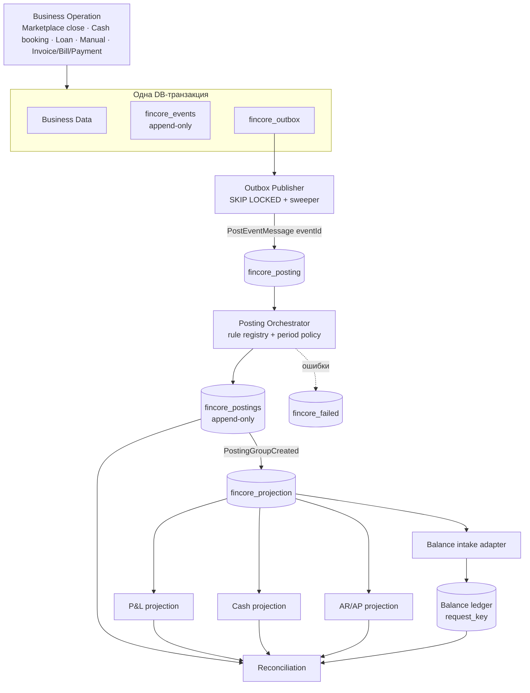

# 04. Target Architecture

Статус: **Решение Stage 0**. Реализуется стадиями `10-migration-roadmap.md`.
Базовые решения вынесены в ADR 001–004; здесь — сводная картина.

## 1. Схема



Модуль: `src/FinancialCore` (новый, по `docs/workflow/new-module.md`),
префикс таблиц `fincore_`. Единственная точка входа для остальных модулей —
`FinancialCoreFacade` (метод `recordEvent(...)` без `flush()`); импорт чужих
`Service/Repository` запрещён (`ModuleBoundaryRules`).

## 2. Source of Truth

| Область | Источник истины (цель) | Сейчас | Примечание |
|---|---|---|---|
| Бизнес-операция | Domain entity своего модуля (`cash_transaction`, `marketplace_*`, `Deal`, будущие `Invoice`/`Bill`) | то же | остаётся в модуле-владельце |
| Финансовый факт | `fincore_events` | нет | неизменяем; идентичность = `idempotency_key` |
| Доставка события | `fincore_outbox` | нет (Redis) | Redis — только транспорт, потеря восстановима |
| Статус обработки | `fincore_event_processing` | статусы по модулям | по (event, consumer) |
| Бухгалтерское воздействие | `fincore_postings` | нет | неизменяемы, сторно |
| P&L | проекция `RECOGNITION`-проводок (`fincore_pnl_daily`) | `pl_daily_totals` из `documents` | до cutover legacy остаётся источником |
| Cash | проекция `CASH`-проводок | `money_account_daily_balance` | |
| AR/AP | проекция `SETTLEMENT`-проводок; первичные документы и платежи — в бизнес-модулях (ADR-005) | нет | отдельный контур |
| Состояние периода | `fincore_periods` + журнал переходов (ADR-007) | `Company::financeLockBefore` (одна дата) | `financeLockBefore` — только совместимость |
| Баланс | журнал Balance; наполняется adapter'ом из проводок | ручной ввод | идемпотентность по `request_key` |
| Справочники (категории, счета, контрагенты) | модули-владельцы | то же | в проводках — только ID и снимок кода категории |
| Правила проводок | `PostingRule` в коде (версионируются) | нет | `rule_code` + `rule_version` пишутся в проводку |

До cutover (Stage 10) **источником остаются legacy-регистры**; ядро работает в
shadow-режиме и сверяется с ними.

## 3. Границы транзакций

| Операция | Транзакция |
|---|---|
| Бизнес-операция + событие + outbox | **Одна.** `Facade::recordEvent()` делает только `persist()` событий/outbox в тот же `EntityManager`; `flush()` — единственный, в Action (CLAUDE.md). Для legacy-путей с несколькими flush (`CashTransactionService::add`) Stage 6 вводит явную `wrapInTransaction` |
| Outbox claim | короткая: `SELECT … FOR UPDATE SKIP LOCKED LIMIT n` → пометка `claimed_at` → commit |
| Dispatch сообщения | **вне** транзакции; после успеха — `published_at` (отдельный UPDATE) |
| Posting Orchestrator | одна транзакция на событие: processing-lock + **проверка состояния периода (ADR-007)** + проводки + новые outbox-строки `PostingGroupCreated` + processing=done; при блокировке периода — только processing=`blocked`, проводок нет |
| Проекции | одна транзакция на (company, день/ключ) с `pg_advisory_xact_lock`; перестройка идемпотентна |
| Balance intake | транзакция внутри Balance (`BalanceLedgerService`), `request_key = fincore:{posting_group_id}`; **между ядром и Balance атомарности нет, её заменяет идемпотентный повтор** |
| Закрытие месяца Marketplace | существующая транзакция `CloseMonthStageAction` расширяется записью события (Stage 4): документ, регистр, метки и событие атомарны |

Запрещено: `dispatch()` внутри бизнес-транзакции в расчёте на «успеет»;
несколько независимых commit'ов для одной бизнес-операции.

## 4. Инварианты (проверяются reconciliation, часть — constraints)

| ID | Инвариант | Обеспечение |
|---|---|---|
| INV-01 | Каждая финансовая бизнес-операция порождает ровно одно событие на ревизию | `UNIQUE(company_id, idempotency_key)`; транзакция операции+события |
| INV-02 | Событие неизменяемо | нет UPDATE-путей; DB-триггер запрета UPDATE/DELETE (Stage 2) |
| INV-03 | Любое событие в состоянии `published` имеет processing-запись для каждого обязательного consumer'а в пределах SLA | reconcile `E-02` |
| INV-04 | Группа проводок появляется целиком или не появляется | одна транзакция оркестратора |
| INV-05 | Проводка неизменяема, исправление — сторно | триггер + отсутствие UPDATE-путей; `UNIQUE(reverses_posting_id)` |
| INV-06 | Проекция = f(проводки): пересчёт даёт тот же результат | reconcile `P-01` |
| INV-07 | Деньги — целые minor units + валюта на каждой сумме; `float` запрещён; исходная валюта не теряется; `reporting_*`/`fx_*` — все или ничего (ADR-008) | `BIGINT` + `CHAR(3)`; CHECK; value object `Money` |
| INV-08 | Все таблицы и запросы ядра ограничены `company_id` (IDOR) | `RepositoryCompanyScopeRule`, составные FK |
| INV-09 | В периоде `SOFT_CLOSED/CLOSED` нет проводок от обычных событий; допустимы только adjustment-события с причиной, пользователем и исходным событием (ADR-007) | проверка состояния периода в оркестраторе; reconcile `X-01` |
| INV-10 | Revenue ↔ AR: признанная выручка по Invoice имеет равную по сумме SETTLEMENT-проводку (+AR) на контрагента/документ (ADR-005) | `balanced_within` правила + reconcile `A-01` |
| INV-11 | Expense ↔ AP: аналогично | `A-02` |
| INV-12 | Payment ↔ AR/AP: Σ аллокаций платежа ≤ суммы платежа; остаток AR/AP = документ − аллокации − кредит-ноты | правило + `A-03` |
| INV-13 | Payment ↔ Cash: каждый платёж имеет ровно одну CASH-проводку на банковском счёте; Σ CASH-проводок по счёту/дню = движению `money_account_daily_balance` | `C-01`, `C-02` |
| INV-14 | Postings ↔ Balance: на группу проводок, помеченную `balance_mapped`, существует ровно одна операция Balance с `request_key=fincore:{group_id}` и совпадающими суммами | `B-01` |
| INV-15 | Replay не меняет результат: `process(e)×N ≡ process(e)` | уникальные ключи + идемпотентный consumer, тест `07` |

## 5. Отношения данных

Решения: ADR-005 (AR/AP), ADR-006 (признание), ADR-008 (деньги).

- **Revenue ↔ AR.** Выручка признаётся событием первичного документа
  (`sales.invoice.issued`) по его `effective_date`: правило порождает
  `RECOGNITION` (доход) и `SETTLEMENT` (+AR на контрагента/документ). Для
  Marketplace до миграции остаётся `marketplace_month_stage_v1` без SETTLEMENT;
  расчёты с маркетплейсом как задолженность — отдельные правила позже
  (ADR-005 п.6).
- **Expense ↔ AP.** Зеркально (`purchase.bill.received`).
- **Payment ↔ AR/AP.** Платёж — отдельное событие `payment.*`, порождающее
  `CASH` и `SETTLEMENT`, **но не `RECOGNITION`** (ADR-006). Аллокация —
  `SETTLEMENT`-проводки (−AR/−AP); частичная оплата = аллокация < остатка;
  предоплата = платёж без документа (остаётся авансом `advance_*`);
  переплата = остаток сверх документа остаётся авансом; возврат =
  обратное событие со ссылкой `causation_id` на платёж; credit-нота =
  уменьшение дохода + −AR; отмена документа = сторно группы проводок.
- **Payment ↔ Cash.** Банковская транзакция (`cash.transaction.booked`) —
  источник CASH-проводки; платёж и банковская транзакция — разные события,
  связываются сопоставлением (аналог текущего `PaymentPlanMatcher`). Cash не
  хранит задолженность.
- **Postings ↔ Balance** (решение Q3, ADR-003 п.6). Balance получает данные
  автоматически через **Balance Intake Adapter**; ядро не пишет в таблицы Balance.
  Поток: `Posting Group → Adapter → Balance operation`, `request_key =
  fincore:{posting_group_id}`. Маппинг `posting/account/category → Balance
  account/article/dimension` — отдельная версионируемая конфигурация компании
  (`fincore_balance_mappings`), не код оркестратора. Группа, для которой маппинг
  неполон или даёт несбалансированный документ Balance, не передаётся —
  finding `balance_mapping_incomplete`. Режимы: `draft/suggestion`
  (`BalanceLedgerService::saveDraft`), затем `auto` (`post`) по
  подтверждению корректности маппинга. Закрытый период **Balance** тоже
  блокирует intake (`blocked`, а не `failed`). Расхождение ловит `B-01`.
- **Деньги и валюта.** Каждая сумма — `amount_minor` + `currency`; FX — поля
  `reporting_*`, `fx_*` (ADR-008). Ядро не приводит события к RUB необратимо;
  проекции и отчёты работают в reporting currency компании, при отсутствии
  курса — `fx_missing`, а не курс 1.0.

## 5a. Период и политика проводки (ADR-007)

```text
event.effective_date → period(company, YYYY-MM) → state:
  OPEN         → проводить
  SOFT_CLOSED  → обычное событие: blocked(period_soft_closed); adjustment: проводить (причина + пользователь)
  CLOSED       → обычное событие: blocked(period_closed);      adjustment: только late-adjustment flow с повышенным правом
```

Эффективное состояние = более строгое из `fincore_periods` и выведенного из
`Company::financeLockBefore` (до Stage 10). `blocked` — нормальное состояние
processing (не ошибка, не DLQ); выходит из него по открытию периода,
пере-датированию события (новая ревизия) или оформлению adjustment.
Replay подчиняется той же политике (`09 §3`).

## 6. Наблюдаемость

Каждое событие несёт `correlation_id` (сквозной, от пользовательского действия
или cron-запуска) и `causation_id` (родительское событие). Лог каждого шага:
`event_id`, `companyId`, `consumer`, `attempt`, статус (CLAUDE.md «Логирование»);
ошибка исчерпанных ретраев — `ERROR` с счётчиком, не на запись. Метрики/гейты
(по `docs/workflow/health-gates.md`: гейт по свежести, не по накопленному объёму;
область гейта = область repair): возраст старейшего `pending` в outbox, число
событий без processing, глубина `fincore_failed`, число `blocked` старше SLA.

## 7. Нецели целевой архитектуры

Не event-sourcing всей системы (бизнес-модули остаются state-based); не
распределённые транзакции; не exactly-once; не замена Balance — он остаётся
журналом баланса и получает данные через adapter.
